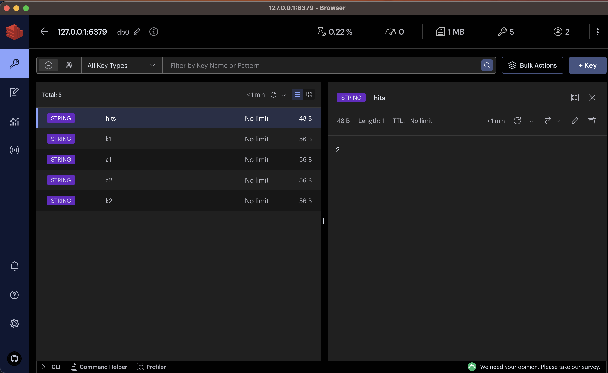

# devcontainer 和 docker-compose的整合
## 建立fastapi和redis整合專合
### devcontainer.json
```json
{
	"name": "Fastapi & Redis",
	"dockerComposeFile": "docker-compose.yml",
	"service": "app",
	"workspaceFolder": "/workspaces/4.使用devcontainer/${localWorkspaceFolderBasename}",
	"features": {
		"ghcr.io/devcontainers/features/github-cli:1": {},
		"ghcr.io/wxw-matt/devcontainer-features/command_runner:0": {}
	},
	"customizations": {
		"vscode": {
			"extensions": [
				"ms-azuretools.vscode-docker",
				"ms-toolsai.jupyter",
				"MS-CEINTL.vscode-language-pack-zh-hant"
			]
		}
	}

```

#### "name": "Fastapi & Redis"
- 建立vscode上的容器名稱

#### "dockerComposeFile": "docker-compose.yml"
- 告知docker-compose.yml的位置,依目前json檔的位置

#### "service": "app"
- 使用docker-compose內的那一個service

#### "workspaceFolder": "/workspaces/4.使用devcontainer/${localWorkspaceFolderBasename}"

- 預設當vscode打開terminal時,必需進入到container內那一個目錄。
- 必需任docker-compose內的volumes內的設定。

### docker-compose.yml
 
```
version: '3.8'

services:
  app:
    build:
      context: ..
      dockerfile: .devcontainer/Dockerfile

    volumes:
      - ../../..:/workspaces

    # Overrides default command so things don't shut down after the process ends.
    command: sleep infinity
    env_file:
      - redis.env

    # Runs app on the same network as the database container, allows "forwardPorts" in devcontainer.json function.
    network_mode: service:db

    # Use "forwardPorts" in **devcontainer.json** to forward an app port locally.
    # (Adding the "ports" property to this file will not forward from a Codespace.)

  db:
    image: redis/redis-stack
    container_name: redis_for_python
    restart: always        
    volumes:
      - ../redis:/data
    ports:
      - 6379:6379 
    env_file:
      - redis.env     
    command: /bin/sh -c "redis-stack-server --requirepass $$REDIS_HOST_PASSWORD"
    
```


#### version: '3.8'
- docker-compose的版本
- 必需放在第一行

#### services:

```
version: '3.8'
services:
  app:
    
  db:
    image: redis    
    
``` 

- 目前有2個services, 一個是app,一個是db

#### build:

```
		build:
		      context: ..
		      dockerfile: .devcontainer/Dockerfile
	  volumes:
      - ../../..:/workspaces
      
    command: sleep infinity
    env_file:
      - redis.env
    
    network_mode: service:db
```

- context:.. 代表那裏是您本地端的的工作目錄,..代表上層目錄,.任表本層目錄
- dockerfile: 依據context設定的目錄，告知Dockerfile的位置
- volumes:任據目前電腦的前3層為對應到container內的workspaces目錄(前3層是為了對應到.git的位置)
- command: sleep infinity 是讓此container保持running的狀態
- env_file:設定儲存環境變數的檔案
- network_mode: service:db ,vscode必需要這樣寫,才可以使用devcontainer.json內的forwardPorts


```
db:
    image: redis
    restart: always        
    volumes:
      - ../redis:/data
    ports:
      - 6379:6379 
    env_file:
      - redis.env     
    command: /bin/sh -c "redis-server --requirepass $$REDIS_HOST_PASSWORD"
```

#### volumes: 是依據目前yml檔案的位置
#### command: 啟動redis-server,並加入密碼,密碼儲存在redis.evn

### redis.env

```
REDIS_HOST_PASSWORD=12345
```

### Dockerfile

```
FROM mcr.microsoft.com/devcontainers/python:1-3.10-bookworm
COPY ./requirements.txt .
RUN pip install -r requirements.txt
ENV PYTHONUNBUFFERED 1
```

#### FROM mcr.microsoft.com/devcontainers/python:1-3.10-bookworm
- 使用devcontainer提供的image

#### COPY ./requirements.txt .
- 依據yml->build->context指定的位置

#### RUN pip install -r requirements.txt
- 執行docker內,根目錄的requirements.txt

### 安裝redisinsight,管理redis



      


