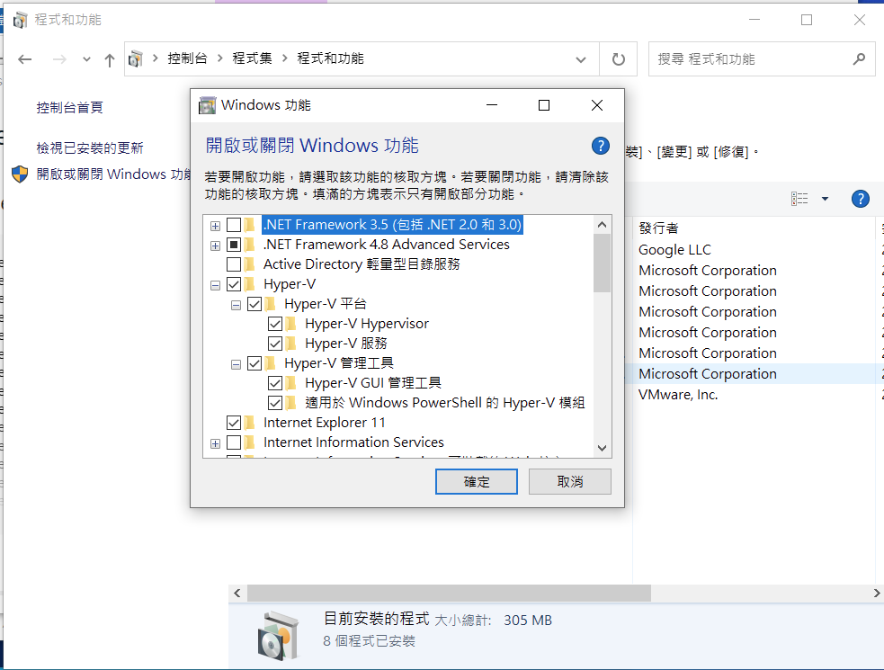
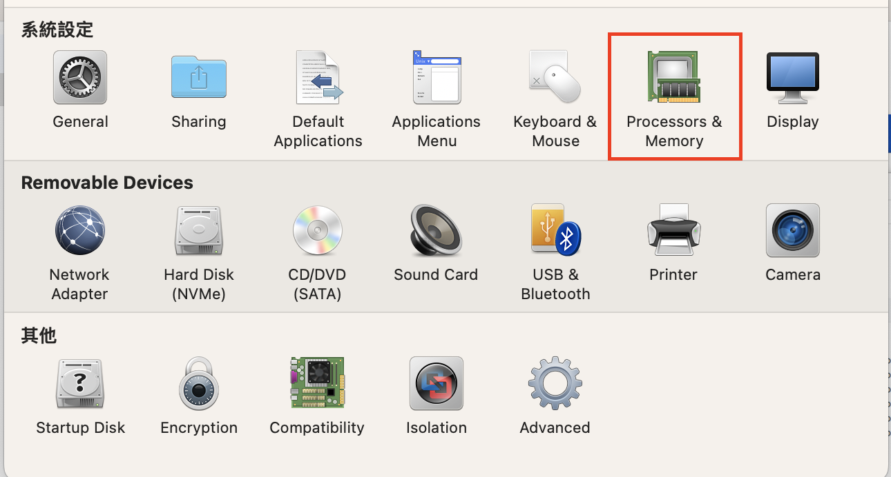
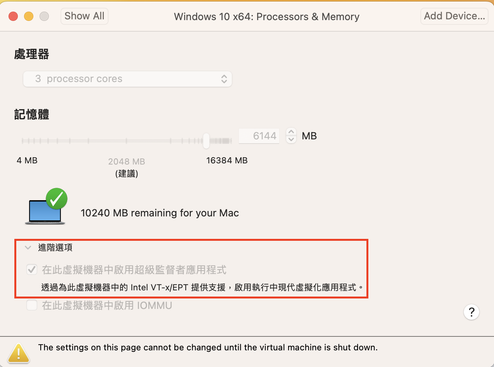

# Docker python開發者環境建立
## windows 安裝 wsl2 的方式(注意事項)
- 只有安裝wsl2後才可以安裝docker
- 使用power shell

```

$ wsl --install
或
$ wls --update

```

- 確認:控制台->程式集->程式和功能->開啟或關閉windows功能


- 如果Hyer-V無法勾選,請在power-shell輸入以下2行指令

```

$ DISM /Online /Enable-Feature /All /FeatureName:Microsoft-Hyper-V

$ bcdedit /set hypervisorlaunchtype auto
```

## 使用WSL2.0,設定使用WSL2.0
- power shell下2段指令

```
$ Enable-WindowsOptionalFeature -Online -FeatureName VirtualMachinePlatform, Microsoft-Windows-Subsystem-Linux

$ wsl --set-default-version 2
```

## 使用Vmware Fution安裝的windows,必需設定virtual machine:

- 請打勾 : processors & memory -> 進階選項 -> 在此虛擬機器中啟用超級監督者應用程式





## 1. 為何要使用Docker?(Why Docker?)
- ***建立虛擬環境***
- ***建立完全獨立環境專案,並提供該專案所有附屬套件***
- 可建立多個服務,如資料庫服務
- 容易部署和發佈
- 讓共同開發者在不同平台有***相同開發環境***
  
## 2. Dockerize an App

- [建立一個python學習的環境](1.建立pyhton學習環境)
- [建立fastapi和redis](2.建立fastapi和redis)

  
## 3. Immediate file changes(Volumes)
- volumes可設定本機資料夾為container所管理的資料夾
- 在docker run 時建立Volumes 

```
 docker run -d \
  --name devtest \
  -v myvol2:/app \
  nginx:latest
```


## 4. Use IDE In Docker
## 5. Docker Compose
## 6. Add more services
## 7. Debug Python code inside Docker