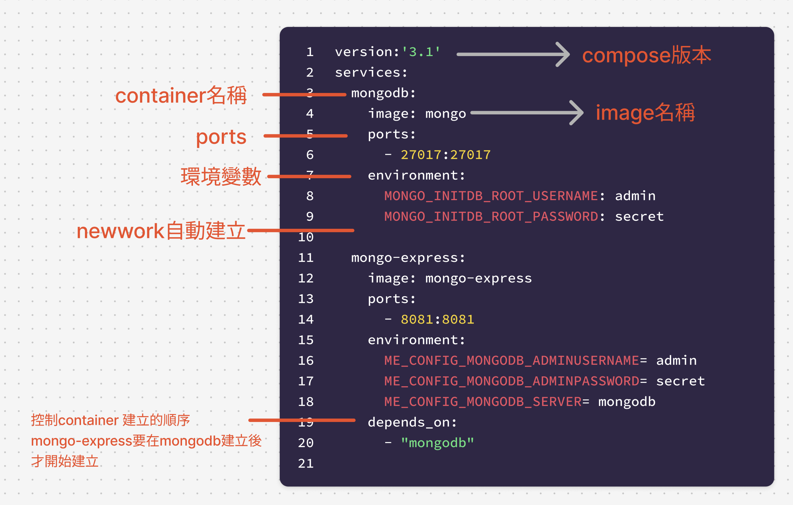
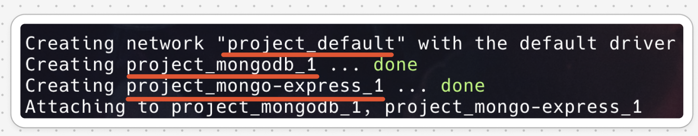

# Docker Compose

## 什麼是docker-compose

Docker Compose 是一個強大的工具，可以簡化多容器應用程式的管理。它允許您使用單一設定檔（通常名為 docker-compose.yml）定義和運行具有多個服務（容器）的複雜應用程式。此設定檔指定服務、它們的依賴項及其設置，使管理和部署應用程式變得更加容易。

## 使用 Docker Compose 的主要優點：

- 簡化管理：使用單一指令定義和管理多個容器。
- 一致的環境：確保您的應用程式在不同環境（開發、測試、生產）中一致運作。
- 更快的開發：快速啟動和拆卸應用程式堆疊以進行測試和開發。
- 改進的協作：與其他人共享應用程式的配置，從而更輕鬆地協作和重現您的設定。

## 檢查是否有安裝docker-compose

```bash
docker-compose --version
```

## 安裝docker-compose

```bash
sudo apt install docker-compose
```


## JSON格式

```json
{
    "doe": "a deer, a female deer",
    "pi": 3.14159,
    "xmas": true,
    "french-hens": 3,
    "calling-birds": [
        "huey",
        "dewey", 
        "louie",
        "fred"
    ],
    "xmas-fifth-day": {
        "calling-birds": "four",
        "french-hens": 3,
        "golden-rings": 5,
        "partridges": {
            "count": 1,
            "location": "a pear tree"
        },
        "turtle-doves": "two"
    }
}
```

## JSON轉換為YML格式
- YML的子結構是以縮排
- Array使用`-`符號表示

```yaml
 doe: "a deer, a female deer"
 ray: "a drop of golden sun"
 pi: 3.14159
 xmas: true
 french-hens: 3
 calling-birds:
   - huey
   - dewey
   - louie
   - fred
 xmas-fifth-day:
   calling-birds: four
   french-hens: 3
   golden-rings: 5
   partridges:
     count: 1
     location: "a pear tree"
   turtle-doves: two
```

## docker compose 檔案結構
- 使用Services top-level elements以下為官網網址

> https://docs.docker.com/reference/compose-file/services/

## 實際案例1(建立2個服務mongodb和mongodb express)

- 建立2個Docker containers
- 使用Docker commands


### 1. 不使用Docker Compose的建立方式
1-1. **建立Docker Network(default bridge)**

```bash
docker network create mongo-network

#檢查
docker network ls
```


1-2. **建立MongoDB Container**
- 搜尋dockerhub Mongo的官方連結
- mondb的default port:27017
- 環境變數root_user和root_password(官網有提供)
	- MONGO_INITDB_ROOT_USERNAME
	- MONGO_INITDB_ROOT_PASSWORD

```bash
docker run -d \
-p 27017:27071 \
-e MONGO_INITDB_ROOT_USERNAME=admin \
-e MONGO_INITDB_ROOT_PASSWORD=secret \
--network mongo-network \
--name mongodb \
mongo
```

```bash
docker ps
```

1-3. **建立Mongo Express Container**
- 搜尋dockerhub Mongo Express的官方連結
- port:8081
- 環境變數(進入mogodb的帳號和密碼)
	- ME_CONFIG_MONGODB_ADMINUSERNAME(帳號)
	- ME_CONFIG_MONGODB_ADMINPASSWORD(密碼)
	- ME_CONFIG_MONGODB_SERVER(mongoDB的容器名稱)

```bash
docker run -d \
-p 8081:8081 \
-e ME_CONFIG_MONGODB_ADMINUSERNAME=admin \
-e ME_CONFIG_MONGODB_ADMINPASSWORD=secret \
-e ME_CONFIG_MONGODB_SERVER=mongodb \
--network mongo-network \
--name mongo-express \
mongo-express
```

```bash
docker ps
```

1-4 **使用browser連線至mongo-express**
1-4 進入mongo-express需要密碼,透過下面命令得到密碼

```bash
docker logs mongo-express

#===output=====
admin:pass
```

1-5 **刪除container network**

```
#先停止container
docker stop mongo-express mongodb

#刪除container
docker rm mongo-express mongodb

#刪除網路
docker network rm mongo-network
```

### 2. 使用Docker Compose的建立方式

- 使用Services top-level elements


2.1 **建立資料夾project**
2.2 **建立mongo-service.yaml**
- 可以至官網copy再修改(https://hub.docker.com/_/mongo)

```yaml
# Use root/example as user/password credentials
version: '3.1'

version: '3.1'

services:

  mongodb:
    image: mongo
    ports:
	    - 27017:27017
    environment:
      MONGO_INITDB_ROOT_USERNAME: admin
      MONGO_INITDB_ROOT_PASSWORD: secret

  mongo-express:
    image: mongo-express
    ports:
      - 8081:8081
    environment:
      ME_CONFIG_MONGODB_ADMINUSERNAME: admin
      ME_CONFIG_MONGODB_ADMINPASSWORD: secret
      ME_CONFIG_MONGODB_SERVER: mongodb
	  depends_on:
		  - "mongodb"
```

2.3 **執行docker-compose**
- `-f`是指定yaml檔案名稱
- `up`建立

```bash
docker-compose -f mongo-services.yaml up
```

2.4 **查看container名稱和網路名稱**
- 名稱會依據資料夾名稱重新命名



2.5 **自訂container名稱的前綴詞,而不是使用資料夾名稱

```bash
docker-compose --project-name 前綴詞 mongo-services.yaml up
```

2.5 **讓container進入detach mode**

- 先離開終端機

```bach
#先離開終端機,container會自動stop
ctrl + c

#使用detach mode(背景模式)
docker-compose -f mongo-services.yaml up -d
```

2.6 **停止和刪除docker-compose建立的container和network**

```bash
docker-compose -f mongo-services.yaml down
```

2.7 **停止 docker-compose**

```bash
#先重新啟動
docker-compose -f mongo-services.yaml up -d

#停止docker-compose
docker-compose -f mongo-services.yaml stop
```

2.8 **啟動docker-compose**

```bash
docker-compose -f mongo-services.yaml start
```


### 3. 使用環境變數建立docker-compose的安全性
**先設定暫時的環境變數**

```bash
export MONGO_ADMIN_USER=admin
export MONGO_ADMIN_PASS=secret
```

```bash
version: '3.1'

services:

  mongodb:
    image: mongo
    ports:
      - 27017:27017
    environment:
      MONGO_INITDB_ROOT_USERNAME: ${MONGO_ADMIN_USER}
      MONGO_INITDB_ROOT_PASSWORD: ${MONGO_ADMIN_PASS}

  mongo-express:
    image: mongo-express
    ports:
      - 8081:8081
    environment:
      ME_CONFIG_MONGODB_ADMINUSERNAME: ${MONGO_ADMIN_USER}
      ME_CONFIG_MONGODB_ADMINPASSWORD: ${MONGO_ADMIN_PASS}
      ME_CONFIG_MONGODB_SERVER: mongodb
    depends_on:
      - "mongodb"
```

```bash
docker-compose -f mongo-services.yaml -d
```

### 4. container 日誌(docker logs)

```bash
docker logs [Options] container
```

**options**
- `f`,`--follow`:在寫入新日誌訊息時持續傳輸新日誌訊息。這對於即時監控很有用。
- `--since`:顯示自特定時間戳記以來的日誌。 (e.g., `--since="2024-11-24T14:00:00"`).
- `--until`:顯示特定時間戳記之前的日誌.
- `--tail`:僅顯示日誌的最後 N 行(e.g., `--tail=100`)

#### 4.1 範例
4.1.1 顯示指定container的所有logs

```bash
docker logs my_container
```

4.1.2 即時串流日誌

```bash
docker logs -f my_container
```

4.1.3 最後50行日誌

```bash
docker logs --tail 50 my_container
```

### 5. docker exec
您可以在已執行的 Docker 容器中執行命令。此命令對於偵錯、維護任務或與容器環境互動而無需重新啟動容器特別有用。

#### 5.1語法

```bash
docker exec [Options] container command [ARG...]
```

- `-i`,`--interactive`:即使未連接，也保持 STDIN 打開.
- `-t`,`--tty`:分配一個偽 TTY，這對於互動式命令很有用。
- `d`,`--detach`:在後台運行該命令。
- `u`,`--user`:指定運行命令的使用者名稱或 UID。
- `--workdir`:設定容器內的工作目錄。

**範例**
1. **在container執行命令列**

```bash
docker exec my_container ls /app
```

2. 建立一個互動的Shell:

```bash
docker exec -it my_container /bin/bash
```

3. 在背景模式執行命令

```bash
docker exec -d my_container /my-long-running-precess
```

4. 在指定目錄下執行執行命令

```bash
docker exec --workdir /opt my_container ls
```


