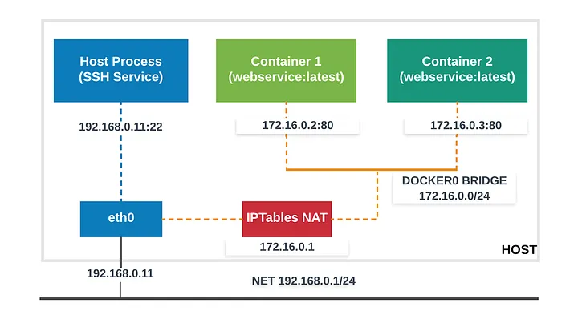
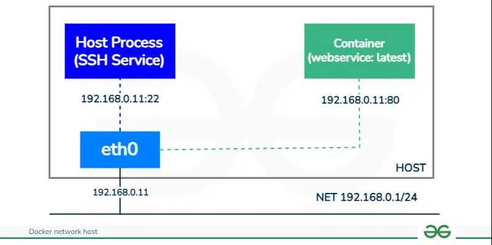
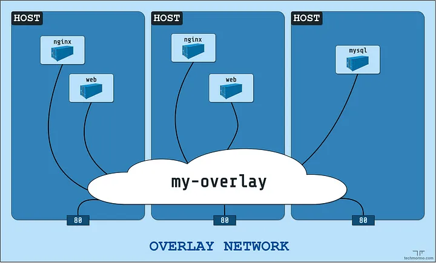

# Docker network

## 什麼是Docker network?

Docker Network 允許容器彼此、主機和外部系統進行通訊。透過使用 Docker 網路，您可以控制容器之間的互動方式、隔離應用程式，並加強容器化環境的安全性。

## Docker network主要功能
- **容器到容器通訊**：同一網路上的容器可以使用容器名稱作為主機名稱輕鬆地相互通訊。

- **容器到主機通訊**：容器可以與主機系統的網路交互，反之亦然。

- **隔離**：網路提供隔離以防止容器互相干擾。

- **自訂配置**：可自訂網路以滿足特定的應用要求。

## Docker network 類型

### 1. Bride Network(default)
- 獨立容器最常見的網路類型。
- 在同一個橋接網路上的容器可以使用它們的名稱進行通訊。
- 若未指定網路，則為容器的預設值。

#### 1.1 建立方式

```bash
docker network ls
docker network create my-bridge-network
```

#### 1.2 範例說明
Docker daemon 會建立虛擬乙太網路橋樑 docker0，自動在任何其他連接的網路介面之間轉發封包。預設情況下，主機上的所有容器都會連接到內部網路。這種模式會將容器放在獨立的網路名稱空間，並透過網路位址轉換 (Network Address Translation) 在眾多容器之間分享主機的外部 IP 位址。



```bash
docker run -d — name -p 8801:80 container1 webservice:latest
ocker run -d — name -p 8802:80 container2 webservice:latest
``` 

### 2. Host Network
- 消除網路隔離並直接使用主機的網路堆疊。
- 適合高效能或調試需求。

#### 2.1 建立方式

```bash
docker run --network=host my-container
```

與 Docker 主機共享網路命名空間的容器在 Docker 網路主機中執行，也稱為 Docker 主機網路。在此選項中，容器直接使用 Docker 主機的網路介面、IP 位址和連接埠，而不是擁有自己的獨立網路堆疊。因此，容器就像直接在主機電腦上執行一樣，無需網路位址轉換 (NAT) 或埠對應，即可輕鬆存取主機資源和服務。需要與 Docker 主機上執行的服務密切互動或需要高效能網路的應用程式，通常會使用此網路替代方案。




```bash
docker run -itd --name <ContainerName> --network=host  -p <HostPort>:<ContainerPort> <image-name>
```

### 3. Overlay Network
- 在Docker Swarm 中用於跨多個主機的服務之間的通訊。
- 需要Swarm 設定。

```bash
docker network create --driver overlay my-overlay-network
```



### 4. None Network

- 容器未連接到任何網路。
- 用於安全或測試隔離環境。

```bash
docker run --network=none my-container
```


### 5. Custom Network

- 允許進階配置，例如自訂子網路或 IP 位址範圍。

```bash
docker network create --subnet=192.168.1.0/24 my-custom-network
```

## 如何使用Docker Networks

### 1. 查看現有的Newworks

```bash
docker network ls
```

### 2. 檢查網路

```bash
docker network inspect <network_name>
```

### 3. 將容器附加到網路

```bash
docker network connect <network_name> <container_name>
```

### 4. 從網路中分離容器

```bash
docker network disconnect <network_name> <container_ame>
```

## 實作範例

```bash

```


