# 簡單的Docker file範例
- 必需先下載[lessons.zip]檔
- 下載網址(https://github.com/roberthsu2003/dockerForDeveloper/raw/refs/heads/main/docker_simple_example/lessons.zip)

```bash
#下載
wget https://github.com/roberthsu2003/dockerForDeveloper/raw/refs/heads/main/docker_simple_example/lessons.zip

#解壓縮
unzip lessons.zip
```

- 依據lessons資夾


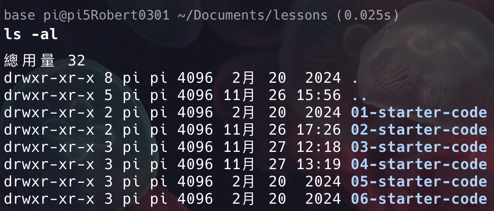

## 範例1-透過Docker_Hub下載python開發環境
- 直接使用Docker_Hub內python官方網站的python image

**使用docker pull 下載docker image**

```bash
docker pull python:3.11-slim

#==output==
3.11-slim: Pulling from library/python
f5c6876bb3d7: Pull complete 
681f5b8ff801: Pull complete 
b1227c93bfb7: Pull complete 
cb08acae466d: Pull complete 
Digest: sha256:873952659a04188d2a62d5f7e30fd673d2559432a847a8ad5fcaf9cbd085e9ed
Status: Downloaded newer image for python:3.11-slim
docker.io/library/python:3.11-slim
```


**檢查python:3.11-slim是否被下載至docker cache images**

```bash
docker images
```


**進入01-starter-code目錄,使用pwd查詢目錄的絕對路徑

```bash
pwd
#=====output=====
/home/pi/Documents/lessons/01-starter-code
```

**使用docker run建立container**
- docker container被建立並執行,執行完成後就關閉
- 使用docker container自動建立的container名稱

```bash
docker run -v "/home/pi/Documents/lessons/01-starter-code:/src/app" \
python:3.11-slim \
python /src/app/python-app.py

#=====output=======
  ____        _   _                  _
   |  _ \ _   _| |_| |__   ___  _ __  / \
   | |_) | | | | __| '_ \ / _ \| '_ \/  /
   |  __/| |_| | |_| | | | (_) | | | /\_/
   |_|    \__, |\__|_| |_|\___/|_| |_(_)
          |___/

             -- Python --
```

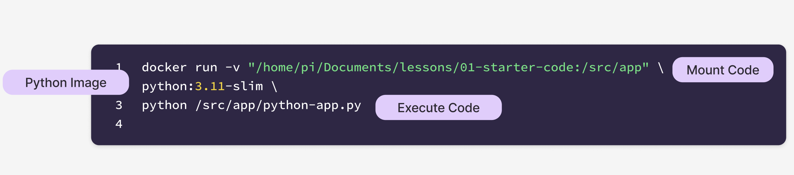

**檢查docker container**

```bash
docker container -a

#====output========
CONTAINER ID   IMAGE                                COMMAND                  CREATED              STATUS                          PORTS     NAMES
6f7ac971ed54   python:3.11-slim                     "python /src/app/pyt…"   About a minute ago   Exited (0) About a minute ago             interesting_shaw
```

**使用container ID刪除container**

```bash
docker rm 6f7ac971ed54
```

**刪除docker image**

```bash
docker image rm python:3.11-slim
```

## 範例2-使用Dockerfile擴充docker image的功能
- 擴充那一個base image(FROM)
- 設定工作目錄(WORKDIR)
- 複制檔案至工作目錄(COPY)
- 應用程式執行(CMD)

**建立Dockerfile**

```bash
## 1. Which base image do you want to use?
FROM python:3.11-slim

## 2. Set the working directory inside the container.
WORKDIR /src/app

## 3. Copy your source code file to the working directory inside the container.
COPY ./python-app.py .

## 4. Define the command to run when the container starts.
CMD ["python", "/src/app/python-app.py"]
```

**使用docker build建立docker image**

```bash
docker build -t flask-application:0.0.1 .
```

**建立docker image**

```bash
docker images

#======output========
REPOSITORY                      TAG         IMAGE ID       CREATED              SIZE
flask-application               0.0.1       c4e1daaa874c   About a minute ago   155MB
```

**建立container**

```bash
docker run flask-application:0.0.1

#==========output==============
    ____        _   _                  _
   |  _ \ _   _| |_| |__   ___  _ __  / \
   | |_) | | | | __| '_ \ / _ \| '_ \/  /
   |  __/| |_| | |_| | | | (_) | | | /\_/
   |_|    \__, |\__|_| |_|\___/|_| |_(_)
          |___/

             -- Python --
```


## 範例3:Dockerfile增加Dependencies

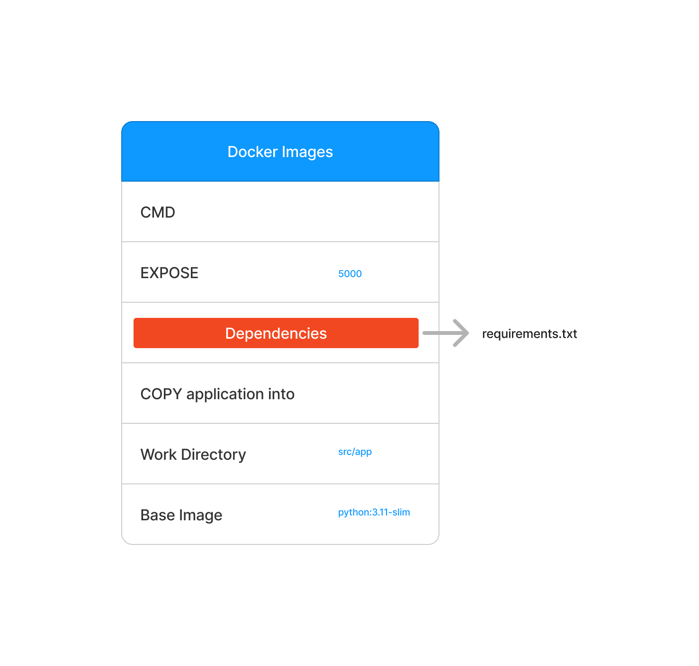

- WORKDIR設定完成後,後面的路徑就以此為根目錄
- RUN是安裝系統需要的套件
- CMD是代表container建立後,要執行的指令

**建立Dockerfile**

```bash
## 1. Which base image do you want to use?
FROM python:3.11-slim

## 2. Set the working directory in the container.
WORKDIR "/src/app/"

## 3. Copy the project files into the working directory.
COPY . .

## 4. Install the dependencies
RUN pip install -r flask-demo/requirements.txt

## 5. Document and inform the developer that the application will use PORT 5000 of the container.
EXPOST 5000

## 6. Define the command to run when the conta/iner starts.
CMD ["python", "flask-demo/app.py"]
```

**建立docker image**

```bash
docker build -t flask-demo:0.0.1 .
```

**使用docker inspect 檢查docker images**

```bash
docker images
#=======output=====
REPOSITORY                      TAG         IMAGE ID       CREATED         SIZE
flask-demo                      0.0.1       e125d92c883a   3 minutes ago   172MB
```

```bash
docker inspect e125d92c883a

#檢查ContainerConfig,查expose port
```

**建立docker container**

```bash
docker run -p 5000:5000 flask-demo:0.0.1
```

**測試連線**


**檢查docker container**

```bash
docker ps

#=======output=====
CONTAINER ID   IMAGE                                COMMAND                  CREATED         STATUS                 PORTS                                       NAMES
2d5da4bef308   flask-demo:0.0.1                     "python flask-demo/a…"   5 minutes ago   Up 5 minutes           0.0.0.0:5000->5000/tcp, :::5000->5000/tcp   awesome_elbakyan
85bfdf0b0ef4   ghcr.io/open-webui/open-webui:main   "bash start.sh"          6 weeks ago     Up 2 weeks (healthy)                                               open-webui
```

**停止docker container**

```bash
docker container stop 2d5da4bef308
```

**刪除docker container**

```bash
docker rm 2d5da4bef308
```

**刪除docker image**

```bash
docker images

#=====output=========
REPOSITORY                      TAG         IMAGE ID       CREATED          SIZE
flask-demo                      0.0.1       e125d92c883a   21 minutes ago   172MB
```

```bash
docker image rm flask-demo:0.0.1
```

## 範例4:push Dockerfile至Docker Hub
- 必需建立一個Docker Hub的帳號
- 必需使用docker login登入帳號
- 適合建立多位開發者共同開發環境

**建立**docker file**

```bash
FROM python:3.8-slim

WORKDIR /usr/service/grade-submission-application

COPY . .

RUN pip install -r grade-submission/requirements.txt

EXPOSE 5000

CMD ["python", "grade-submission/app.py"]

```

**建立docker image**
- 建立的docker image name 必需前面使用docker hub的帳號(帳號名稱/name:tag)

```bash
docker build -t roberthsu2003/grade-submission:flask-0.0.1 .
```

**檢查docker image**

```bash
docker images

#=======output========
REPOSITORY                       TAG           IMAGE ID       CREATED         SIZE
roberthsu2003/grade-submission   flask-0.0.1   685a3901f6e1   2 minutes ago   162MB
```

```bash
docker inspect 685a3901f6e1

#======output======
檢查"ContainerConfig"內的資料,有expost port的資訊和env的資訊
```


**上傳至Docker Hub**
- Prompt:`如何將 Docker 映像推送到 Docker Hub？`
<details>
How do I push a Docker image to Docker Hub?
</details>

```bash
docker push <your-username>/<your-repo-name>
```

```bash
docker push roberthsu2003/grade-submission:flask-0.0.1

#=====output========
The push refers to repository [docker.io/roberthsu2003/grade-submission]
6c179026ab9b: Pushed
15ed0e796a70: Pushed
9d8107f6d0f5: Pushed
71be48336db2: Mounted from library/python
68927dfce826: Mounted from library/python
01183e0d6e03: Mounted from library/python
054df1200f3e: Mounted from library/python
flask-0.0.1: digest: sha256:1a12cea806601102d4a053c316748721885581be0a991ff0a50fbecb2253eae5 size: 1785
```

**檢查docker hsu內是否有上傳**
- Prompt:`哪裡可以找到我自己的 docker 映像檔？`
<details>
Where can I find my own docker images?
</details>

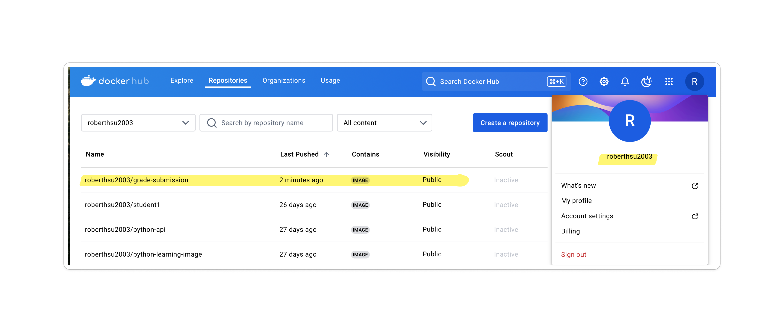

**其他開發者可以使用docker pull下載docker image**

```bash
docker pull roberthsu2003/grade-submission:flask-0.0.1
```

**透過docker inspect了解images內的設定**

```bash
docker inspect roberthsu2003/grade-submission:flask-0.0.1
```

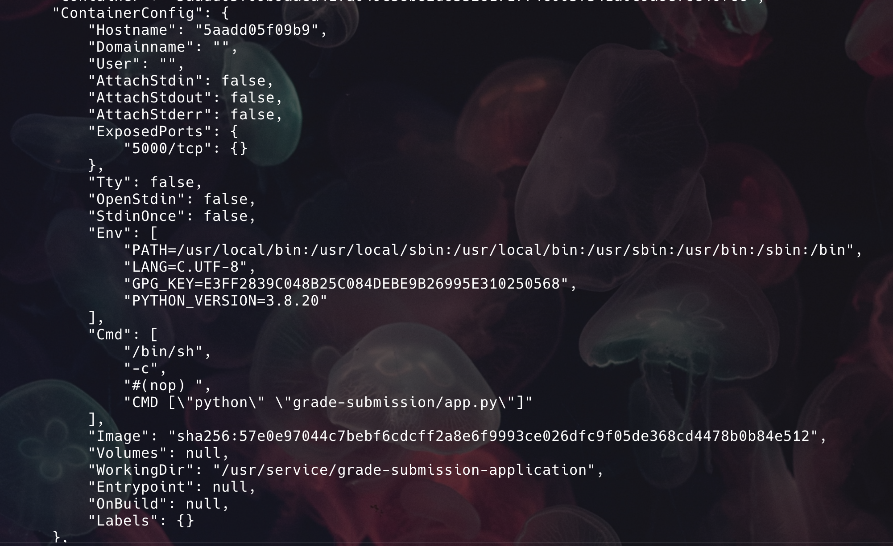

**建立docker container**
- 其它開發者透過docker inspect,了解有expose 5000

```bash
docker inspect <image-name>
```

```bash
docker run -p 2741:5000 roberthsu2003/grade-submission:flask-0.0.1
```

**使用:2741(tcp port)開啟flash 應用程式**
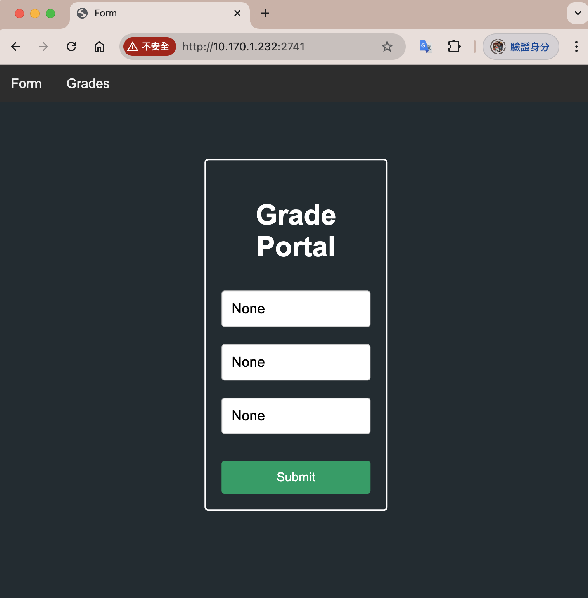

## 範例5:建立環境變數(必需結合下一個範例才可以執行)
- 環境變數可以建立於Dockerfile內(不重要的資訊)

```Dockerfile
FROM node:14
ENV NODE_ENV=production
ENV PORT=3000
WORKDIR /usr/src/app
COPY package*.json ./
RUN npm install
```

- 環境變數經常保留重要的資訊,例如,database的user,password,database_name
- 由於資訊是重要的,不可能儲存於image內
- 所以只有在執行container時提供

```Dockerfile
# -e後的就是環境變數
docker run -e LOG_SERVER=192.168.0.1 -e USE_UNENCRYPTED_STORAGE=1 alpine:latest sh
```

- Prompt:`如何在 Docker 中建立環境變數？`
<details>
How do I create environment variables within Docker?
</details>

**檢查目前專案目錄**

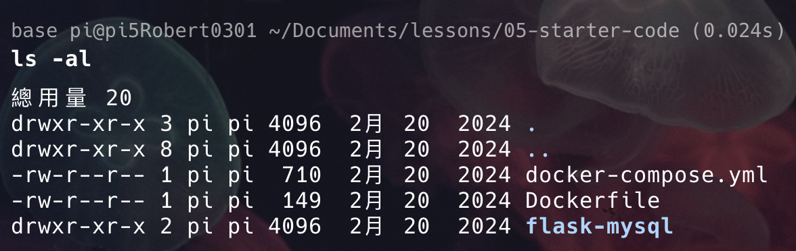

**檢查目前應用程式會用到的環境變數**
- 檢查app.py(查看所有要用的環境變數)
- 所需要的環境變數有以下
	- DATABASE_HOST
	- DATABASE_USER
	- DATABASE_PASSWORD
	- DATABASE_NAME

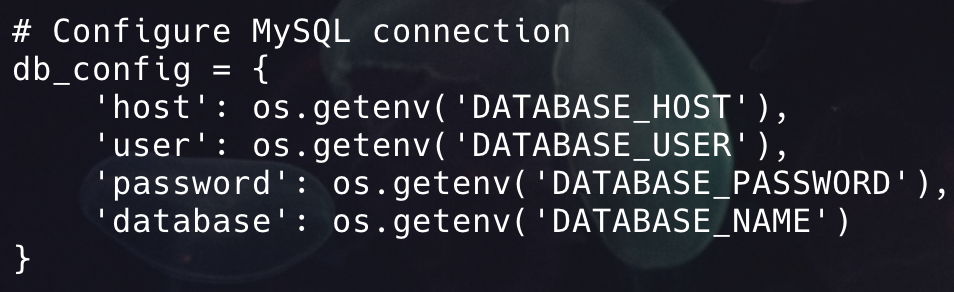

**建立Dockerfile**

```Dockerfile
FROM python:3.8-slim

WORKDIR /usr/src/

COPY . .

RUN pip install -r flask-mysql/requirements.txt

EXPOSE 3000

CMD ["python", "flask-mysql/app.py"]
```


**建立Docker image**

```bash
docker build -t flask-mysql:latest .
```

**建立docker container(沒有提供環境變數)**

- 由於沒有提供環境.app.py執行出現錯誤

```bash
docker run -p 8000:3000 flask-mysql:latest

#=====output=======
Traceback (most recent call last):
  File "flask-mysql/app.py", line 18, in <module>
    raise RuntimeError(f"Environment variable for '{key}' is not set.")
RuntimeError: Environment variable for 'host' is not set.
```

**建立docker container(有提供環境變數)**
- 依舊會出現錯誤,因為沒有建立mysql server(下一範例會建立mysql server)
- host.docker.internal->代表container可以直接使用host的網路

**mac,windows系統**

```bash
docker run -p 8000:3000 \
-e DATABASE_HOST=host.docker.internal \
-e DATABASE_USER=user \
-e DATABASE_PASSWORD=password \
-e DATABASE_NAME=db \
flask-mysql:latest
```

**linux系統**

```bash
docker run -p 8000:3000 \
--add-host=host.docker.internal:host-gateway \
-e DATABASE_HOST=host.docker.internal \
-e DATABASE_USER=user \
-e DATABASE_PASSWORD=password \
-e DATABASE_NAME=db \
flask-mysql:latest

```

**出現沒有連結至mysql的訊息**


## 範例6:建立mysql server
- 使用範例5的範例

**下載mysql image**

```bash
docker pull mysql/mysql-server:8.0
```

**建立mysql container**

```bash
docker docker run \
-e 'MYSQL_DATABASE=db' \
-e 'MYSQL_USER=user' \
-e 'MYSQL_PASSWORD=password' \
-p 3306:3306 \
mysql/mysql-server:8.0
```

**連線flask-mysql:latest**
- flask-mysql:latest內的app.py成功連線mysql

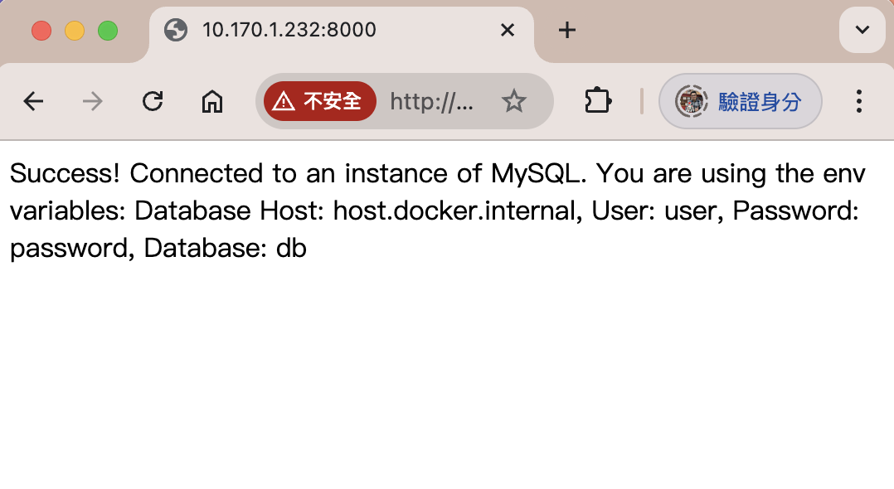

## 範例7:使用docker-compose完成建立2個container

- 清除所有container和images
- 依舊使用05-starter-code

**建立Dockerfile**

```bash
FROM python:3.8-slim

WORKDIR /usr/src/

COPY . .

RUN pip install -r flask-mysql/requirements.txt

EXPOSE 3000

CMD ["python", "flask-mysql/app.py"]
```

**建立docker images**

```bash
docker build -t flask-mysql:latest .
```

**建立docker-compose.yml**

```yaml
version: '3.3'
services:
  mysql:
    image: mysql/mysql-server:8.0
    environment:
      MYSQL_DATABASE: 'db'
      MYSQL_USER: 'user'
      MYSQL_PASSWORD: 'password'
    ports:
      - '3306:3306'

  flaskapp:
    image: flask-mysql:latest
    depends_on:
      - mysql
    environment:
      DATABASE_HOST: 'mysql'
      DATABASE_USER: 'user'
      DATABASE_PASSWORD: 'password'
      DATABASE_NAME: 'db'
    ports:
      - '8000:3000'
```

**執行docker-compose**

```bash
docker compose up
```

**測試連線**



**停止docker-compose,並刪除container**

```bash
docker compose down
```

## 範例8:建立docker volumes並儲存mysql的資料
- 使用06-starter-code
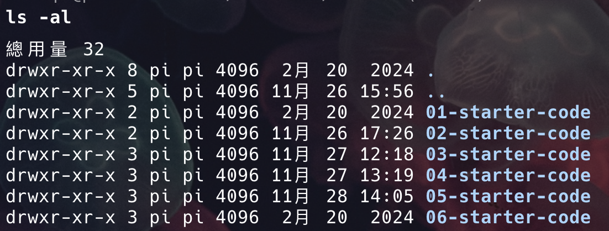

**建立Dockerfile**

```bash
FROM python:3.8-slim

WORKDIR /usr/src/

COPY . .

RUN pip install -r grade-submission/requirements.txt

EXPOSE 8080

CMD ["python", "grade-submission/app.py"]
```

**建立docker image**

```bash
docker build -t grade-submission:0.0.1 .
```

**建立docker-compose.yml**

```yml
version: '3.3'
services:
  mysql:
    image: mysql/mysql-server:8.0
    environment:
      MYSQL_DATABASE: 'db'
      MYSQL_USER: 'user'
      MYSQL_PASSWORD: 'password'
    ports:
      - '3306:3306'
    volumes:
      - new-db:/var/lib/mysql

  flaskapp:
    image: grade-submission:0.0.1
    depends_on:
      - mysql
    environment:
      DATABASE_HOST: 'mysql'
      DATABASE_USER: 'user'
      DATABASE_PASSWORD: 'password'
      DATABASE_NAME: 'db'
    ports:
      - '8080:8080'
volumes:
  new-db:
```

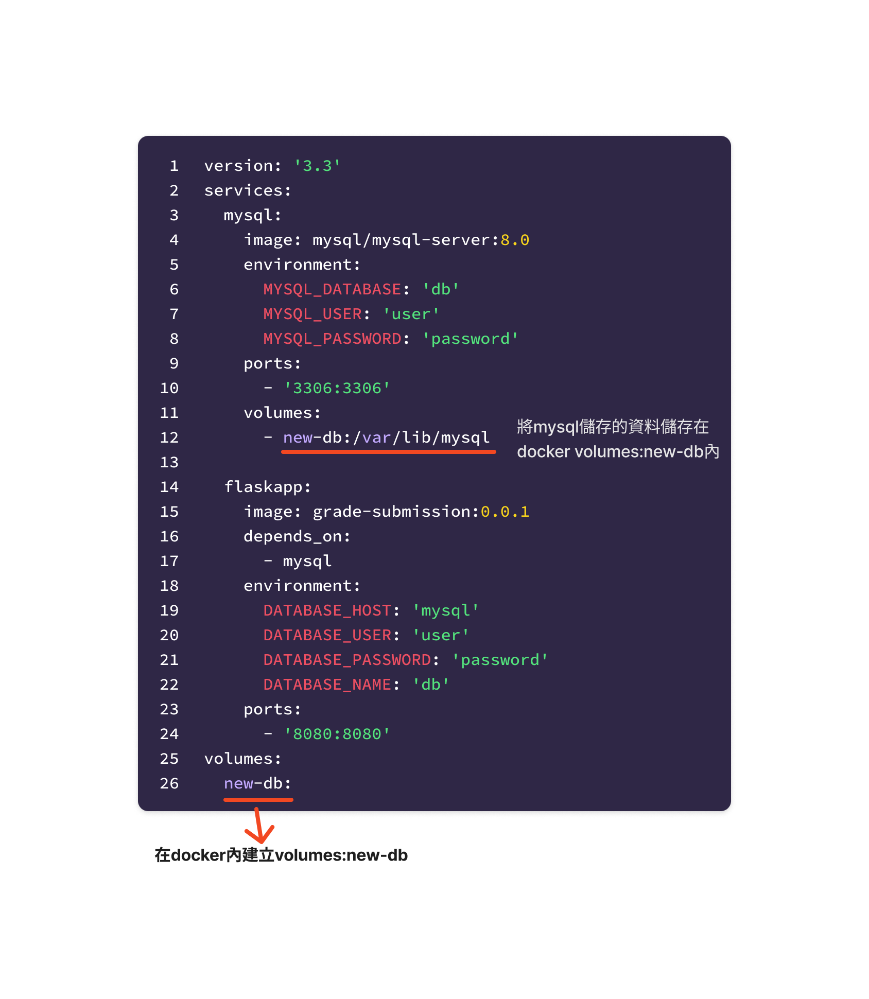

**執行docker-compose**

```bash
docker compose up
```

**檢查docker volumes**

```bash
docker volume ls
```

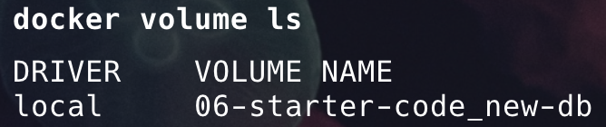


 