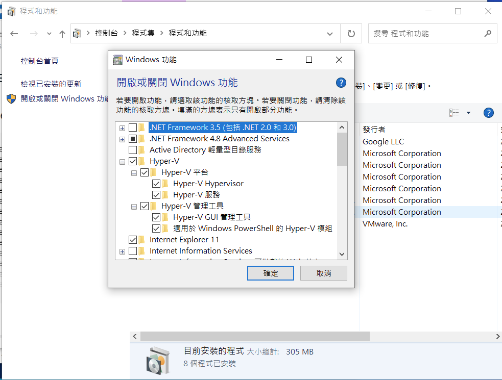
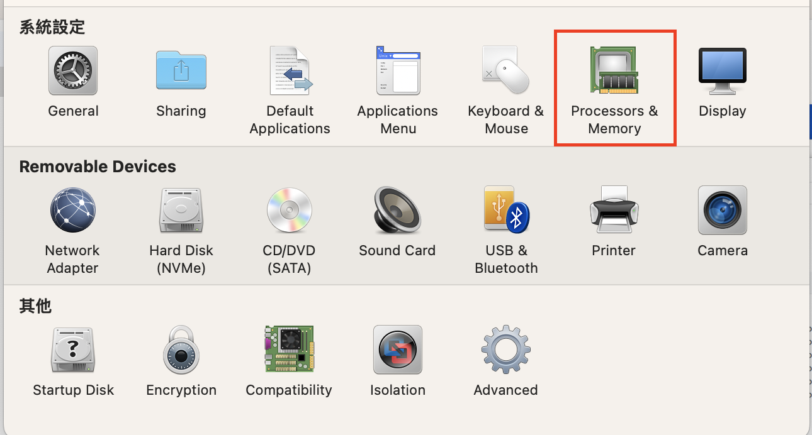
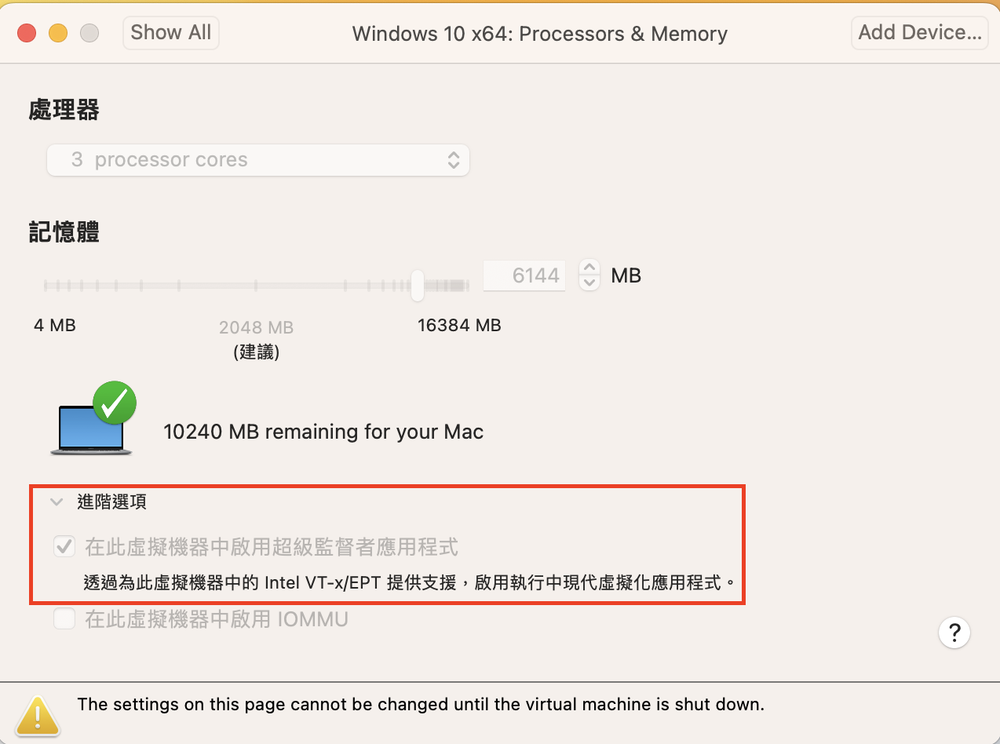

# Windows案裝Docker Desktop

## windows 安裝 wsl2 的方式(注意事項)

- 只有安裝wsl2後才可以安裝docker
- PC BIOS Virtualization 必需開啟
- 使用power shell

```bash

$ wsl --install
或
$ wsl --update

```

- 確認:控制台->程式集->程式和功能->開啟或關閉windows功能


- 如果Hyer-V無法勾選,請在power-shell輸入以下2行指令

```bash

DISM /Online /Enable-Feature /All /FeatureName:Microsoft-Hyper-V

bcdedit /set hypervisorlaunchtype auto
```

## 使用WSL2.0,設定使用WSL2.0

- power shell下2段指令

```bash
Enable-WindowsOptionalFeature -Online -FeatureName VirtualMachinePlatform, Microsoft-Windows-Subsystem-Linux

wsl --set-default-version 2
```

## 使用Vmware Fution安裝的windows,必需設定virtual machine

- 請打勾 : processors & memory -> 進階選項 -> 在此虛擬機器中啟用超級監督者應用程式




