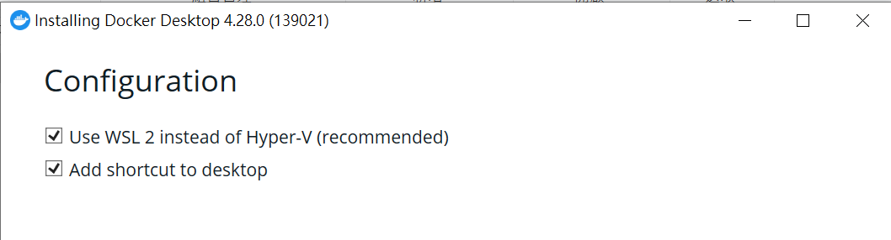

# Windows安裝Docker Desktop

## 1. windows 安裝 wsl2 的方式(注意事項)

- 只有安裝wsl2後才可以安裝docker
- **PC BIOS Virtualization** 必需開啟
- 使用**powershell**

**1.1 檢查是否有安裝WSL**

```bash
wsl -l
```

**1.2 安裝WSL**

```bash
wsl --install
```

**1.3 更新WSL**

```bash
wsl --update
```

**如果無法安裝,做以下嘗試**

- 確認:控制台->程式集->程式和功能->開啟或關閉windows功能


- 如果Hyer-V無法勾選,請在power-shell輸入以下2行指令

```bash

DISM /Online /Enable-Feature /All /FeatureName:Microsoft-Hyper-V

bcdedit /set hypervisorlaunchtype auto
```

## 2. 安裝Docker Desktop

**2.1至原廠說明和下載**

https://docs.docker.com/desktop/install/windows-install/

**2.1安裝時的選項**




